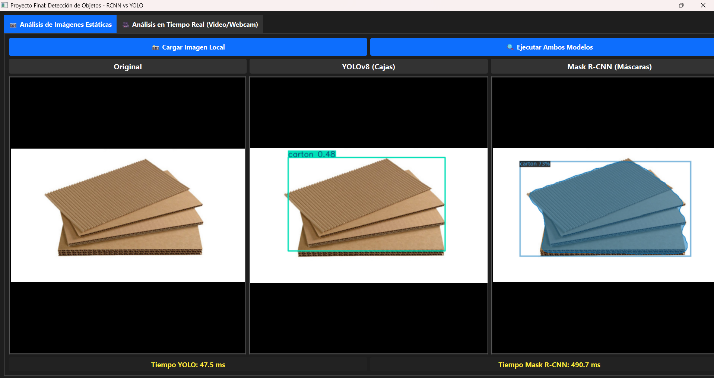
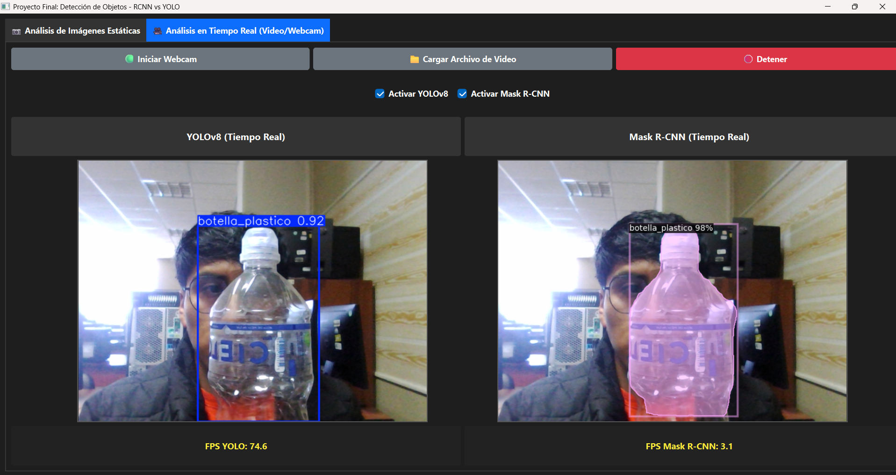

# Comparativa de Detección de Objetos: Mask R-CNN vs YOLOv8 ♻️

**Universidad Nacional del Altiplano Puno - Ingeniería de Sistemas**

**Curso:** Visión Artificial — **Docente:** Fernandez Chambi, Mayenka — **Semestre:** X, **Grupo:** B  
**Autores:**
* Quispe Ticona, Angel Pedro
* Angles Quispe, Carlos Mauricio
* Mamani Turpo, Elfer
* Huanca Chambi, Cristian Brayan

---

## 1. Objetivo
Comparar la detección de residuos sólidos (5 clases: Botella de Plástico, Lata, Vaso, Cartón, Envoltura) usando un enfoque basado en regiones (Mask R-CNN) y un enfoque de una sola etapa (YOLOv8).

## 2. Arquitecturas Evaluadas
* **YOLOv8 Nano:** Arquitectura *Single-Stage* que prioriza la velocidad de inferencia a través de cajas delimitadoras (Bounding Boxes). Ideal para aplicaciones en tiempo real.
* **Mask R-CNN (ResNet50 FPN):** Arquitectura *Two-Stage* que recorta la silueta exacta del objeto (Segmentación de Instancias). Computacionalmente más pesada, pero extremadamente precisa delineando los bordes del objeto.

## 3. Demostración de la Aplicación
Se desarrolló una interfaz gráfica (GUI) en PyQt6 para la inferencia y comparativa en paralelo de ambos modelos, acelerada por hardware (NVIDIA GTX 1650).

### 3.1. Análisis Estático (Imágenes)
Se observa el recorte milimétrico de las máscaras generadas por Mask R-CNN versus las cajas delimitadoras ultrarrápidas de YOLO.

### 3.2. Análisis en Tiempo Real (Video / Webcam)
Ejecución en vivo demostrando la disparidad de fotogramas por segundo (FPS) en un mismo entorno de hardware.

## 4. Métricas de Evaluación (Dataset Estandarizado COCO)
Tras entrenar ambos modelos con nuestro dataset, se obtuvieron los siguientes resultados estáticos durante la evaluación sobre el conjunto de Validación.

### Resumen General (mAP@50)
| Modelo | mAP@50 (Precisión General) | Precision (P) | Recall (R) |
| :--- | :---: | :---: | :---: |
| **Mask R-CNN** (Segmentación) | **56.72%** | N/A | 57.00% |
| **YOLOv8 Nano** (Cajas) | **37.40%** | 50.00% | 35.40% |

> *Nota:* Mask R-CNN superó en precisión a YOLOv8 Nano en esta prueba. Esto era de esperarse dado que Mask R-CNN utiliza un backbone masivo (`ResNet50`) diseñado para extraer características complejas, mientras que YOLOv8n es un modelo ultraligero diseñado para sacrificar un poco de precisión a cambio de máxima velocidad. Adicionalmente, YOLOv8 fue entrenado por un número reducido de épocas (50).

### Desglose de Precisión por Clases (mAP@50 o AP)
| Clase | Mask R-CNN (AP) | YOLOv8 (mAP50) |
| :--- | :---: | :---: |
| **Botella de Plástico** | 64.01% | 50.50% |
| **Lata** | 47.51% | **61.30%** |
| **Vaso** | 46.38% | 28.20% |
| **Envoltura** | 42.39% | 24.70% |
| **Cartón** | 30.40% | 22.40% |

## 5. Rendimiento en Tiempo Real
* **Velocidad (FPS):** YOLOv8 logra procesar el flujo de video a altísimas tasas de cuadros por segundo, permitiendo una experiencia completamente fluida. Mask R-CNN, debido a la complejidad matemática de la generación de polígonos, sufre un cuello de botella, reduciendo los FPS significativamente cuando se ejecuta en secuencia.
* **Calidad de Detección:** Mientras que YOLOv8 detecta el objeto encerrándolo en un rectángulo, Mask R-CNN logra aislar los píxeles exactos de la basura. Esto es indispensable para robótica de precisión (ej. brazos mecánicos clasificadores).

## 6. Conclusión
Si el objetivo es implementar una cámara de vigilancia en un basurero inteligente que cuente los residuos **en tiempo real**, la aproximación basada en **YOLO es superior** por su velocidad. Si el objetivo es análisis científico o robótica donde se requiere aislar la forma geométrica del desecho, **Mask R-CNN es la opción adecuada** pese a su mayor costo computacional.

---
## Referencias
1. Girshick, R., Donahue, J., Darrell, T., & Malik, J. (2014). Rich feature hierarchies for accurate object detection and semantic segmentation. *CVPR*.
2. He, K., Zhang, X., Ren, S., & Sun, J. (2016). Deep residual learning for image recognition. *CVPR*.
3. Jocher, G., Chaurasia, A., & Qiu, J. (2023). *Ultralytics YOLO (v8.0.0)* [Software]. https://github.com/ultralytics/ultralytics
4. Lin, T.-Y., Maire, M., Belongie, S., Hays, J., Perona, P., Ramanan, D., Dollár, P., & Zitnick, C. L. (2014). Microsoft COCO: Common objects in context. *ECCV*.
5. Lin, T.-Y., Dollár, P., Girshick, R., He, K., Hariharan, B., & Belongie, S. (2017). Feature pyramid networks for object detection. *CVPR*.
6. Redmon, J., Divvala, S., Girshick, R., & Farhadi, A. (2016). You only look once: Unified, real-time object detection. *CVPR*.
7. Ren, S., He, K., Girshick, R., & Sun, J. (2015). Faster R-CNN: Towards real-time object detection with region proposal networks. *NeurIPS*.
